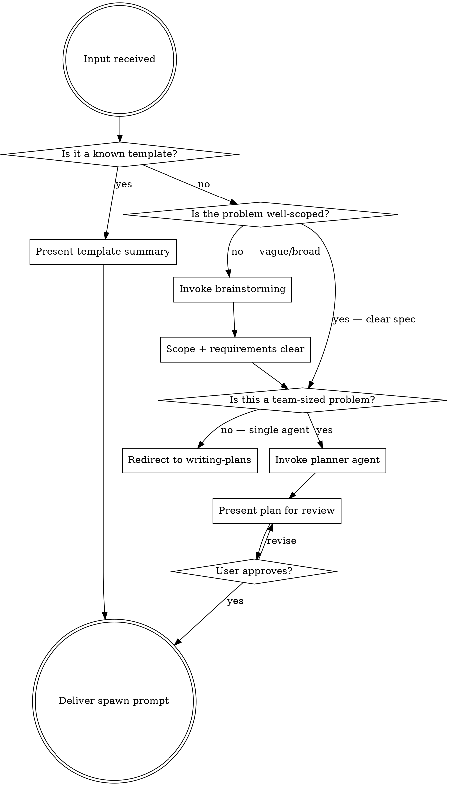

# /team-creation — Scope, Plan, and Structure a Multi-Agent Team

Turn a problem into an agent team plan. This skill handles **creation only** — scoping the problem, defining roles, building the task list, and producing a spawn prompt. Execution (TeamCreate, spawning agents, phase gating) happens after, either by pasting the spawn prompt or following `superpowers:dispatching-parallel-agents`.

## Pipeline

```
[problem] → brainstorm/scope → team structure → task list → spawn prompt → DONE
```



## Usage

```
/team-creation                        # interactive — asks what you need
/team-creation <description>          # scope + plan a team for this task
/team-creation health                 # existing template: monorepo health
/team-creation deep-clean             # existing template: full sweep
/team-creation knip-audit             # existing template: dead code audit
/team-creation list                   # show available templates
```

---

## Step 0: Prerequisites

Verify agent teams are enabled:

```bash
claude config get experiments.agentTeams
```

If not enabled:
> Agent teams require the experimental flag. Enable with:
> `claude config set --global experiments.agentTeams true`

Stop until enabled.

---

## Step 1: Triage

Parse input to determine path:

| Input | Path |
|-------|------|
| `list` | **List** — show templates, stop |
| `health`, `deep-clean`, `knip-audit` | **Template** — present existing template |
| Clear, detailed spec | **Plan** — skip brainstorming, go to Step 3 |
| Vague, broad, or exploratory | **Brainstorm** — invoke brainstorming first |
| No args | **Interactive** — ask what they want to build |

### How to judge "well-scoped"

A problem is well-scoped when you can answer ALL of:
- What packages/modules are affected?
- What are the concrete deliverables?
- What are the acceptance criteria?

If any are unclear → brainstorm first.

---

## Step 2a: List mode

Read `${CLAUDE_PLUGIN_ROOT}/team-templates/` and present:

```
Available team templates:
  health             — lint/types/knip/test on changed packages
  deep-clean         — full workspace sweep, all checks
  knip-audit         — dead code audit across workspace
  k8s-jobs-migration — migrate k8s job definitions
  migrate-scripts    — migrate monorepo scripts

Usage:
  /team-creation <name>           — use a template
  /team-creation <description>    — plan a custom team
```

Stop after listing.

## Step 2b: Template mode

Map shortcut to file:

| Shortcut | Template |
|----------|---------|
| `health` | `${CLAUDE_PLUGIN_ROOT}/team-templates/monorepo-health.md` |
| `deep-clean` | `${CLAUDE_PLUGIN_ROOT}/team-templates/monorepo-deep-clean.md` |
| `knip-audit` | `${CLAUDE_PLUGIN_ROOT}/team-templates/knip-config-audit.md` |

1. Read the template
2. Present summary (name, agents, phases, cost estimate)
3. Generate the spawn prompt (see Step 5)
4. **Done** — skill ends here

## Step 2c: Brainstorm mode

The problem is vague or broad. Invoke brainstorming to scope it:

```
Skill tool: superpowers:brainstorming
```

**Important adaptation**: Brainstorming normally ends by invoking `writing-plans`. In this context, intercept that transition. When brainstorming produces a design/spec, return here to Step 3 instead of going to `writing-plans`.

After brainstorming completes, you have:
- Clear requirements and scope
- Identified packages/modules
- Acceptance criteria

Now evaluate: **is this actually a team-sized problem?**

### Team-size decision

| Signal | Verdict |
|--------|---------|
| 1-3 files, single module, sequential work | **Not a team** — redirect to `writing-plans` |
| 3+ files across multiple independent modules | **Team candidate** |
| Parallel exploration adds value (competing hypotheses, cross-layer) | **Team candidate** |
| Same-file edits, heavy dependencies between tasks | **Not a team** — single session is better |

If not team-sized:
> This looks like a single-agent task. Invoking `/writing-plans` instead.

If team-sized: proceed to Step 3.

---

## Step 3: Research + Plan (parallel dispatch)

This is where the real work begins. Dispatch **two agents in parallel**:

### 3a: Researcher — deep context gathering (background)

Dispatch a `team-researcher` agent in the background to explore the affected packages via Arcana + CocoIndex + code. This runs while brainstorming (if active) or while you assemble the planner prompt.

```
Agent(
  subagent_type = "claude-plugin-pnpm:team-researcher",
  model = "opus",
  run_in_background = true,
  name = "scout",
  prompt = """
  Investigate the following for an upcoming team planning session:

  Task: {task description}
  Affected packages: {package list or best guess}

  Your job:
  1. Query Arcana for prior work, gotchas, architecture decisions on these packages
  2. Query CocoIndex Code for existing implementations, key types, module boundaries
  3. Explore code to map: entry points, data flows, coupling between modules
  4. Document everything in findings.md — the planner will read this

  Focus on what a planner needs to know to decompose this into agent tasks:
  - Which files exist and what they do
  - Where the module boundaries are
  - What gotchas or constraints exist
  - What patterns are already established
  """
)
```

### 3b: Assemble planner context

While the researcher runs, assemble what you already know:

1. **Task description** — from user input or brainstorming output
2. **Affected packages** — `git diff --name-only` or from brainstorming scope
3. **Constraints** — from brainstorming acceptance criteria or user input

Wait for the researcher to complete. Read its `findings.md` output.

---

## Step 4: Invoke the planner agent

**The planner is THE agent for initial planning.** Do not use `team-architect` here — the planner produces both the human-readable design and the executable team plan.

```
Agent(
  subagent_type = "claude-plugin-pnpm:planner",
  model = "opus",
  prompt = """
  Task: {task description}

  Affected packages: {list}
  Constraints: {from brainstorming or user}

  ## Researcher findings
  {paste or summarize the researcher's findings.md here}

  Generate a complete team plan following FRAMEWORK.md.
  Output to team-session/{team-name}/

  The researcher already queried Arcana and CocoIndex — use their findings
  as your starting point. You should STILL query both tools yourself for
  anything the researcher may have missed, but don't duplicate their work.
  """
)
```

The planner produces:
- `design.md` — human-readable architecture summary (components, data flow, gotchas)
- `team-plan.md` — full plan with roles, tasks, ownership, phases
- `team-scope.json` — scope config (if scope enforcement needed; plugin hooks auto-discover it)

### Present for review

Read **both** `design.md` and `team-plan.md`. Present the design first (humans read this), then the plan summary:

> **Design: {name}**
> {key points from design.md — components, approach, risks}
>
> **Team Plan:**
> | Name | Role | Model | Phase |
> |------|------|-------|-------|
> | ... | ... | ... | ... |
>
> **Tasks:** {count}
> **Phases:** {count}
> **File ownership:** {summary — no overlaps}
>
> Full design: `team-session/{name}/design.md`
> Full plan: `team-session/{name}/team-plan.md`
>
> Want to adjust anything, or approve to get the spawn prompt?

If user requests changes → edit the plan, re-present.
If user approves → Step 5.

---

## Step 5: Deliver spawn prompt

This is the **terminal output** of the skill. Generate a ready-to-paste natural language prompt that will create and execute the team:

```
Read `team-session/{team-name}/team-plan.md`.
Create a team named "{team-name}" using TeamCreate.
Press Shift+Tab to enable delegate mode.
Spawn agents per template. You are lead — orchestrate and gate phases only. Do NOT implement.
```

For template mode, point to the template file instead:

```
Read `${CLAUDE_PLUGIN_ROOT}/team-templates/{template}.md`.
Create a team named "{team-name}" using TeamCreate.
Press Shift+Tab to enable delegate mode.
Spawn agents per template. You are lead — orchestrate and gate phases only. Do NOT implement.
```

Present this to the user:

> **Team plan ready.** Paste this to start execution:
>
> ```
> {spawn prompt}
> ```
>
> This will create the team and begin orchestration. The lead agent follows `superpowers:dispatching-parallel-agents` for parallel agent spawning.

**Skill ends here.** Do not execute the team — that's a separate action.

---

## What This Skill Does NOT Do

- **Execute teams** — no TeamCreate, no spawning agents, no phase gating
- **Replace brainstorming** — invokes it when needed, doesn't duplicate it
- **Replace writing-plans** — redirects to it for single-agent tasks
- **Force brainstorming** — skips it when the problem is already well-scoped

## Relationship to Other Skills and Agents

| Skill / Agent | Relationship |
|-------|-------------|
| `superpowers:brainstorming` | Invoked in Step 2c when problem is vague. Brainstorming scopes the problem; this skill structures the team. |
| `superpowers:writing-plans` | For single-agent tasks. If team-size check fails, redirect there instead. |
| `superpowers:dispatching-parallel-agents` | Covers execution. The spawn prompt this skill produces is designed to be executed following that pattern. |
| `team-researcher` agent | Dispatched in Step 3a (background) for deep context gathering via Arcana + CocoIndex before the planner runs. |
| `planner` agent | Invoked in Step 4 to generate design.md + team-plan.md. THE agent for initial planning — do not use team-architect here. |
| `team-architect` agent | NOT used during initial planning. Used mid-execution by the lead when a specific module needs deeper investigation before coders start. |

## Edge Cases

| Situation | Action |
|-----------|--------|
| Agent teams not enabled | Show enable command, stop |
| No template matches shortcut | Fall through to custom/brainstorm path |
| Researcher returns nothing useful | Planner still runs its own Arcana + CocoIndex queries — researcher findings are additive, not required |
| Planner fails | Show error, offer retry or manual planning |
| User wants to modify plan | Edit and re-present |
| Not team-sized after brainstorming | Redirect to `writing-plans` |
| User already has a spec/design doc | Skip brainstorming, go straight to Step 3 |
| User says "just run it" after plan | Present the spawn prompt, remind them execution is a separate step |
