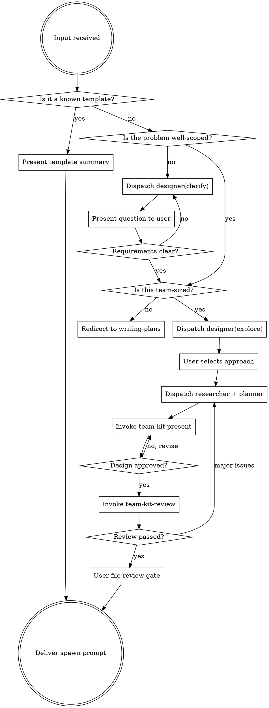

# /team-kit-create — Scope, Plan, and Structure a Multi-Agent Team

Turn a problem into an agent team plan. This skill handles **creation only** — scoping the problem, defining roles, building the task list, and producing a spawn prompt. Execution (TeamCreate, spawning agents, phase gating) happens after.

## Core Pattern: Lead Dispatches, Designers Execute

**Lead stays lean.** Heavy lifting happens in designer agents:

```
Lead dispatches designer(phase: "clarify") → ONE question → returns
Lead dispatches designer(phase: "clarify") → ONE question → returns
Lead dispatches designer(phase: "explore") → 2-3 approaches → returns
User picks approach
Lead dispatches planner → design.md + team-plan.md → returns
```

Lead owns: user communication, phase transitions, context accumulation.
Designer owns: research, question generation, approach exploration.

## Pipeline

```
[problem] → clarify loop → explore → research + plan → present → review → spawn prompt
```



## Usage

```
/team-kit-create                        # interactive — asks what you need
/team-kit-create <description>          # scope + plan a team for this task
/team-kit-create health                 # existing template: monorepo health
/team-kit-create deep-clean             # existing template: full sweep
/team-kit-create knip-audit             # existing template: dead code audit
/team-kit-create list                   # show available templates
```

---

## Step 0: Prerequisites

Verify agent teams are enabled:

```bash
claude config get experiments.agentTeams
```

If not enabled:
> Agent teams require the experimental flag. Enable with:
> `claude config set --global experiments.agentTeams true`

Stop until enabled.

---

## Step 1: Triage

Parse input to determine path:

| Input | Path |
|-------|------|
| `list` | **List** — show templates, stop |
| `health`, `deep-clean`, `knip-audit`, `debug` | **Template** — present existing template |
| Contains "debug", "investigate", "root cause", "why is...broken" | **Debug** — use debug template with issue extracted |
| Contains "design", "spec", "requirements", "what should we build" | **Design** — dispatch designer phases, then planner |
| Clear, detailed spec | **Plan** — skip clarification, go to Step 3 |
| Vague, broad, or exploratory | **Clarify** — dispatch designer(clarify) loop |
| No args | **Interactive** — ask what they want to build |

### How to judge "well-scoped"

A problem is well-scoped when you can answer ALL of:
- What packages/modules are affected?
- What are the concrete deliverables?
- What are the acceptance criteria?

If any are unclear → clarify first.

---

## Step 2a: List mode

Read `${CLAUDE_PLUGIN_ROOT}/team-templates/` and present:

```
Available team templates:
  health             — lint/types/knip/test on changed packages
  deep-clean         — full workspace sweep, all checks
  knip-audit         — dead code audit across workspace
  debug              — systematic debugging for complex bugs
  k8s-jobs-migration — migrate k8s job definitions
  migrate-scripts    — migrate monorepo scripts

Usage:
  /team-kit-create <name>           — use a template
  /team-kit-create <description>    — plan a custom team
  /team-kit-create debug <issue>    — debug investigation team
```

Stop after listing.

## Step 2b: Template mode

Map shortcut to file:

| Shortcut | Template |
|----------|---------|
| `health` | `${CLAUDE_PLUGIN_ROOT}/team-templates/monorepo-health.md` |
| `deep-clean` | `${CLAUDE_PLUGIN_ROOT}/team-templates/monorepo-deep-clean.md` |
| `knip-audit` | `${CLAUDE_PLUGIN_ROOT}/team-templates/knip-config-audit.md` |
| `debug` | `${CLAUDE_PLUGIN_ROOT}/team-templates/debug-investigation.md` |

1. Read the template
2. Present summary (name, agents, phases, cost estimate)
3. Generate the spawn prompt (see Step 7)
4. **Done** — skill ends here

## Step 2c: Clarify Loop (dispatch designer)

When problem is vague/broad, run the clarify loop.

**Follow `team-kit-clarify` skill** — it tells you HOW to dispatch.

### The Loop

```javascript
clarify_context = {
  problem: original_problem,
  previous_answers: [],
  resolved: {}
}

while (!requirements_clear) {
  // Dispatch designer for ONE question
  Agent({
    subagent_type: "claude-plugin-pnpm:team-designer",
    description: `Clarify requirements - question ${N}`,
    prompt: `
Phase: clarify

Problem: ${clarify_context.problem}

Previous answers:
${clarify_context.previous_answers.map(a => `Q: ${a.question}\nA: ${a.answer}`).join('\n\n')}

Generate ONE focused question to clarify requirements.
`
  })
  
  // Present question to user
  // Collect answer
  // Add to context
  // Evaluate: are ALL requirements clear?
}
```

### Exit Condition

Requirements clear when lead can answer ALL:

| Question | Answer |
|----------|--------|
| What packages/modules? | [list] |
| What deliverables? | [list] |
| What acceptance criteria? | [list] |
| Any constraints? | [list or none] |

### Team-size decision

After clarification, evaluate: **is this actually a team-sized problem?**

| Signal | Verdict |
|--------|---------|
| 1-3 files, single module, sequential work | **Not a team** — redirect to single-agent planning |
| 3+ files across multiple independent modules | **Team candidate** |
| Parallel exploration adds value | **Team candidate** |
| Same-file edits, heavy dependencies between tasks | **Not a team** — single session is better |

If not team-sized:
> This looks like a single-agent task. Use standard implementation approach.

If team-sized: proceed to Step 3.

---

## Step 3: Approach Exploration (dispatch designer)

Before committing to a design, explore alternatives.

**Follow `team-kit-explore` skill** — it tells you HOW to dispatch.

### Dispatch

```javascript
Agent({
  subagent_type: "claude-plugin-pnpm:team-designer",
  description: "Explore implementation approaches",
  prompt: `
Phase: explore

Requirements:
- Packages: ${clarify_context.resolved.packages.join(', ')}
- Deliverables: ${clarify_context.resolved.deliverables.join(', ')}
- Acceptance criteria: ${clarify_context.resolved.acceptance_criteria.join(', ')}
- Constraints: ${clarify_context.resolved.constraints.join(', ')}

Problem context:
${clarify_context.previous_answers.map(a => `Q: ${a.question}\nA: ${a.answer}`).join('\n\n')}

Explore codebase. Propose 2-3 approaches with tradeoffs and recommendation.
`
})
```

### User Selection

Present approaches, ask user to pick. Record selection:

```javascript
explore_result = {
  chosen_approach: "A: [Name]",
  key_decisions: [...],
  constraints_to_honor: [...]
}
```

Proceed to Step 4.

---

## Step 4: Research + Plan (parallel dispatch)

### 4a: Researcher — deep context gathering (background)

Dispatch `team-researcher` agent in background:

```javascript
// First, create session folder
const session_path = `team-session/${team_name}/`
// mkdir -p ${session_path}

Agent({
  subagent_type: "claude-plugin-pnpm:team-researcher",
  model: "opus",
  run_in_background: true,
  name: "scout",
  prompt: `
Investigate the following for an upcoming team planning session:

## Session Path
Session path: \`${session_path}\`
Write output to: \`${session_path}researcher/\`

## Task
Task: ${task_description}
Chosen approach: ${explore_result.chosen_approach}
Affected packages: ${clarify_context.resolved.packages}

Your job:
1. Query Arcana for prior work, gotchas, architecture decisions
2. Query CocoIndex for existing implementations, key types, module boundaries
3. Explore code to map: entry points, data flows, coupling between modules
4. Document everything in findings.md — the planner will read this

Focus on what a planner needs to decompose this into agent tasks.
`
})
```

### 4b: Invoke planner

After researcher completes, invoke planner with chosen approach:

```javascript
Agent({
  subagent_type: "claude-plugin-pnpm:planner",
  model: "opus",
  prompt: `
## Session Path
Session path: \`${session_path}\`
Write output to: \`${session_path}\`
Read researcher findings from: \`${session_path}researcher/\`

## Task
Task: ${task_description}

**Chosen approach**: ${explore_result.chosen_approach}
**Key decisions**: ${explore_result.key_decisions.join(', ')}

Affected packages: ${clarify_context.resolved.packages}
Constraints: ${explore_result.constraints_to_honor}

## Requirements (from clarification)
${JSON.stringify(clarify_context.resolved, null, 2)}

## Researcher findings
{paste or summarize the researcher's findings.md here}

Generate a complete team plan following FRAMEWORK.md.
Output to team-session/{team-name}/

The researcher already queried Arcana and CocoIndex — use their findings
as your starting point.
`
})
```

Planner produces:
- `design.md` — human-readable architecture summary
- `team-plan.md` — full plan with roles, tasks, ownership, phases
- `team-scope.json` — scope config for hook enforcement

---

## Step 5: Present Design (invoke team-kit-present)

After planner returns, present design section-by-section:

```
Skill tool: team-kit-present
```

This skill handles incremental approval:
1. Components/Architecture → approve
2. Data Flow/Interfaces → approve
3. File Ownership → approve
4. Task List → approve

If any section rejected → revise → re-present.

After all sections approved, proceed to Step 6.

---

## Step 6: Post-Plan Review (invoke team-kit-review)

Run review checklist on design.md + team-plan.md:

```
Skill tool: team-kit-review
```

This skill checks:
- Placeholder scan (no TBD/TODO)
- Internal consistency
- Type consistency
- Ambiguity check
- Scope check

If review passes → proceed to Step 7.
If issues found → fix or re-run planner → re-review.

---

## Step 7: File Review Gate + Spawn Prompt

### 7a: User file review

Before delivering spawn prompt, ask user to review actual files:

> "Plan complete. Please review these files before proceeding:
> - `team-session/{team-name}/design.md` — architecture summary
> - `team-session/{team-name}/team-plan.md` — full execution plan
>
> Let me know if you want any changes."

Wait for user approval. If changes requested → edit → re-present relevant sections.

### 7b: Deliver spawn prompt

After user approves files, generate ready-to-paste prompt:

```
Read `team-session/{team-name}/team-plan.md`.
Create a team named "{team-name}" using TeamCreate.
Press Shift+Tab to enable delegate mode.
Spawn agents per template. You are lead — orchestrate and gate phases only. Do NOT implement.
```

For template mode, point to template file instead:

```
Read `${CLAUDE_PLUGIN_ROOT}/team-templates/{template}.md`.
Create a team named "{team-name}" using TeamCreate.
Press Shift+Tab to enable delegate mode.
Spawn agents per template. You are lead — orchestrate and gate phases only. Do NOT implement.
```

Present to user:

> **Team plan ready.** Paste this to start execution:
>
> ```
> {spawn prompt}
> ```
>
> This will create the team and begin orchestration.

**Skill ends here.** Do not execute the team — that's a separate action.

---

## Lead's Role: Delegation Model

Lead orchestrates, does NOT implement. Lead dispatches:

| Agent | Role | When dispatched |
|-------|------|-----------------|
| `team-designer` | Clarify questions, explore approaches | Steps 2c, 3 (multiple dispatches) |
| `team-researcher` | Deep context via Arcana + CocoIndex + code | Step 4a (background) |
| `planner` | Generate design.md + team-plan.md | Step 4b (after researcher) |

Lead owns:
- User communication (presenting questions, getting approvals)
- Phase transitions (deciding when clarify is complete, when to proceed)
- Context accumulation (building clarify_context, explore_result)
- Skill invocation (team-kit-present, team-kit-review)
- Final spawn prompt delivery

Lead does NOT:
- Do codebase research (designer/researcher do this)
- Generate questions (designer does this)
- Make technical decisions (planner does this)

---

## Context Flow

```
clarify_context (lead accumulates)
    ↓
explore_result (from designer)
    ↓
researcher findings (from researcher)
    ↓
planner input (lead synthesizes)
    ↓
design.md + team-plan.md (from planner)
```

---

## What This Skill Does NOT Do

- **Execute teams** — no TeamCreate, no spawning agents, no phase gating
- **Implement code** — lead delegates all implementation
- **Skip clarification for vague problems** — always clarify when scope unclear
- **Commit to approach without user input** — always explore alternatives first
- **Do codebase research itself** — dispatches designer/researcher for that

## Relationship to Other Skills

| Skill | Relationship |
|-------|-------------|
| `team-kit-clarify` | Dispatch guide for designer(phase: clarify) loop |
| `team-kit-explore` | Dispatch guide for designer(phase: explore) |
| `team-kit-present` | Invoked in Step 5 for section-by-section approval |
| `team-kit-review` | Invoked in Step 6 for post-plan review |
| `investigation-methodology` | Used by designer and researcher for codebase exploration |

## Related Agents

| Agent | When to use |
|-------|-------------|
| `team-designer` | Clarify + explore phases — stateless, phase-aware |
| `planner` | Planning phase — produces design.md + team-plan.md |
| `team-researcher` | Deep context gathering before planner |
| `team-architect` | Mid-execution module deep-dive (NOT initial planning) |

## Edge Cases

| Situation | Action |
|-----------|--------|
| Agent teams not enabled | Show enable command, stop |
| No template matches shortcut | Fall through to custom/clarify path |
| Researcher returns nothing useful | Planner still runs — researcher findings are additive |
| Planner fails | Show error, offer retry |
| User wants to modify plan | Edit and re-present relevant sections |
| Not team-sized after clarification | Redirect to single-agent approach |
| User already has a spec/design doc | Skip clarification, go to approach exploration |
| User says "just run it" after plan | Present spawn prompt, remind execution is separate |
| Review finds major issues | Re-run planner with feedback, not just inline fixes |
